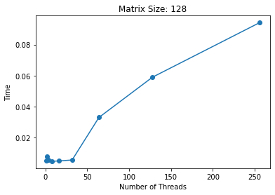
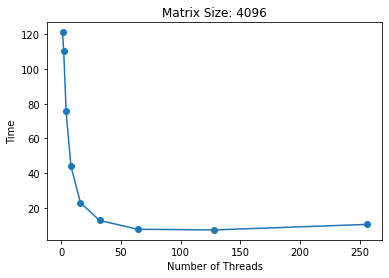

# Parallel Analysis
Analyzing performance of a parallel LU decomposition algorithm on [Texas A&amp;M's Grace HPRC](https://hprc.tamu.edu/kb/User-Guides/Grace/#grace-a-dell-x86-hpc-cluster) cluster at different thread counts and  matrix sizes.

